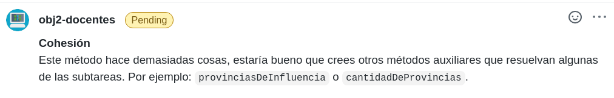
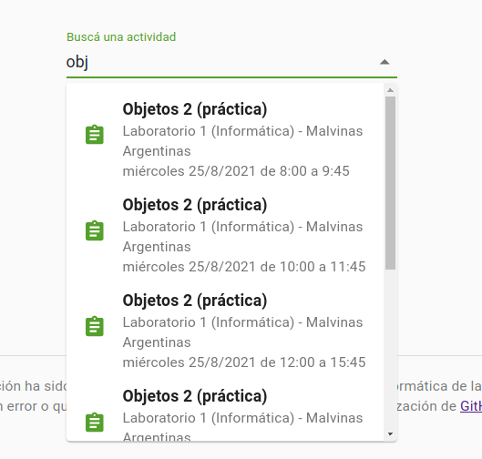

## Clase 2

## Desarrollo guiado por pruebas (TDD)


===

<div style='position: relative; padding-bottom: 56.25%; padding-top: 35px; height: 0; overflow: hidden;'><iframe sandbox='allow-scripts allow-same-origin allow-presentation' allowfullscreen='true' allowtransparency='true' frameborder='0' height='315' src='https://www.mentimeter.com/embed/5dcc0e54b5cb768b4990a8ca983b5074/fcaa00fc379a' style='position: absolute; top: 0; left: 0; width: 100%; height: 100%;' width='420'></iframe></div>

<small>Pueden escribir sobre el ejercicio, la metodología, el lenguaje... lo que quieran.</small>

===

## Sobre la entrega

--

### Calificación

Para este primer trabajo será **aprobado** o **desaprobado**, no se recupera en ningún caso.

Los siguientes serán de aprobación obligatoria, debiendo recuperarlos si no se aprobaran en primera instancia.

--

### Metodología de trabajo

> Trabajen **completando cada requerimiento** antes de pasar al siguiente, **con los tests** que aseguran que funciona incluidos.

--

### Cualidades de diseño

Las vamos a presentar formalmente en la próxima clase, pero ya empezamos a incluirlas en las correcciones.



--

### Tests

Para esta entrega solo esperabamos que hagan algunos, pero para las siguientes ya corregiremos con detalle.

--

### ¿Cómo testear un error?

_(tomado del apunte **Matchers de Kotest**)_

```kotlin
it('falla al agregar vendedor existente') {
  val centroTesei = CentroDistribucion(buenosAires)

  centroTesei.agregarVendedor(juana)
  centroTesei.agregarVendedor(juana).shouldThrowException()
});
```

--

```kotlin
it('falla al agregar vendedor existente') {
  val centroTesei = CentroDistribucion(buenosAires)

  // La agrega
  centroTesei.agregarVendedor(juana)

  // La siguiente va a fallar, por eso lo hago dentro del {}
  shouldThrowMessage("Ya existe esa persona en la nómina") {
    centroTesei.agregarVendedor(juana)
  }
});
```

===

## TDD - ¿qué es?

- Práctica de diseño de software orientado a objetos (extensible a otros paradigmas).
- Metodología de trabajo.
- Aplicable en cualquier lenguaje de programación.
- Pensar primero en el uso y luego en la implementación.

--

Más detalles en el video introductorio.

===

## Reglas de oro

> Nunca escribas nueva funcionalidad sin una prueba que falle antes. (Kent Beck)

> Si no puedes escribir una prueba para lo que estás por programar, entonces no deberías estar pensando en programar. (Dave Chaplin)

===

## Técnica


--

<div style='position: relative; padding-bottom: 56.25%; padding-top: 35px; height: 0; overflow: hidden;'><iframe sandbox='allow-scripts allow-same-origin allow-presentation' allowfullscreen='true' allowtransparency='true' frameborder='0' height='315' src='https://www.mentimeter.com/embed/1decedf115002b00ad815874cceaaf57/2e766cc4e896' style='position: absolute; top: 0; left: 0; width: 100%; height: 100%;' width='420'></iframe></div>

===

## Actividades de la semana

### Definir el equipo

Creamos un canal para quienes aún no lo tienen. Lo definen en el momento de clonar el repositorio.

### Caralibro

Resolver usando TDD.

--

### Compus de la UNaHur

Ya está todo instalado con Linux en las compus, busquen la actividad **Objetos 2 (práctica)**.



===

# ¿Preguntas?


