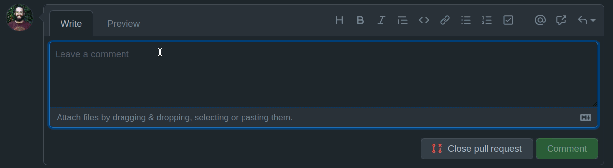
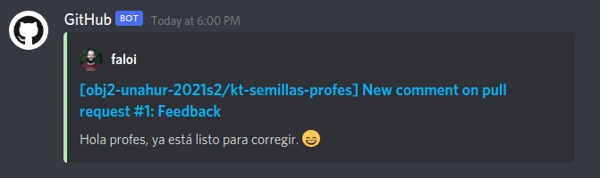

## Clase 4

## Patrón Composite


===

<div style='position: relative; padding-bottom: 56.25%; padding-top: 35px; height: 0; overflow: hidden;'><iframe sandbox='allow-scripts allow-same-origin allow-presentation' allowfullscreen='true' allowtransparency='true' frameborder='0' height='315' src='https://www.mentimeter.com/embed/aec73e69ddf82f94714139dfbd2cad00/f3619fb0966f' style='position: absolute; top: 0; left: 0; width: 100%; height: 100%;' width='420'></iframe></div>

<small>☝️ No cierren la página, que hay dos preguntas.</small>

===

## Strategy

Algunos comentarios para tener en cuenta.

--

### ¿Y el `if` ya pasó de moda?

**NO.** Siempre hay que tener la simplicidad como bandera.

--

### Preguntas para orientar la decisión

- **¿La estrategia puede cambiar?** Si no, por ahí alcanza con subclases.
<!-- .element: class="fragment" -->

- **¿Hay solo dos opciones?** Se puede arrancar con un `if` y después cambiar.
<!-- .element: class="fragment" -->

- **¿Las estrategias tienen configuraciones propias?** Tal vez sea mejor usar _Strategy_ desde el principio.
<!-- .element: class="fragment" -->

- **¿Es altamente probable que aparezcan nuevas estrategias?** Tal vez sea mejor usar _Strategy_ desde el principio.
<!-- .element: class="fragment" -->

===

## Semillas al viento

Si borraron los comentarios, **no cumplieron con la consigna**.

Hasta que no los pongan, no les corregimos. 😖

--

Repasemos las cualidades y dónde estaban en el ejercicio.

--

### Simplicidad

_No hacer cosas de más._

- `Agricultora.comprarParcela` -> no está en el enunciado, es un invento.

--

### Robustez

_¿Cómo se comporta el sistema ante un error?_

- `Parcela.plantar` -> reporta los errores usando `println` en vez de arrojar una excepción.

--

### Redundancia mínima

_El conocimiento debe estar en un solo lugar._

- `Parcela.cantidadMaximaPlantas` -> Repite el código que ya está implementando en el método `superficie`.
- `Parcela.cantidadPlantas` -> Se puede calcular a partir del `size` de la lista de plantas, no es necesario tener otra variable.
- `Planta.daSemillas` -> La primera parte (`this.esFuerte()`) está repetida en todas las subclases.

--

```kotlin
abstract class Planta(...) {
  open fun daSemillas() =
    this.esFuerte() || this.condicionEspecifica()

  abstract fun condicionEspecifica(): Boolean;
}

class Menta(...) : Planta(...) {
  override fun condicionEspecifica() = this.altura > 0.4
}

class Soja(...) : Planta(...) {
  override fun condicionEspecifica() =
    this.anioObtencionSemilla > 2007 && this.altura > 1
}

class SojaTransgenica(...) : Soja(...) {
  override fun daSemillas() = false
}
```

<!-- .element: class="fullscreen" -->

A este patrón se lo conoce como **Template method**.

<!-- .element: class="fragment" -->

--

### Acoplamiento

_¿Cuánto conoce un componente sobre otro?_

- `Agricultora.parcelasSemilleras` -> el cálculo para saber si `esSemillera` debería estar en la `Parcela`.
- `Agricultora.plantarEstrategicamente` -> no usa el método `plantar` de la `Parcela`, agregando la planta directamente y saltándose los chequeos que la parcela tiene.

--

### Cohesión

_¿Cuántas responsabilidades tiene un componente?_

- `Soja transgénica` -> con una sola clase se está queriendo representar a dos tipos de `Soja`.
- `Planta.parcelaTieneComplicaciones` -> este método no tiene que ver con las responsabilidades de la `Planta`, debería estar en la `Parcela`.
- `Agricultora.plantarEstrategicamente` -> este método hace dos cosas: busca la parcela y luego la planta. Se podría delegar la primera en otro método.

--

### Mutaciones controladas

_Reducir al mínimo posible el efecto._

- `Planta.altura` -> debería ser `val`, porque en el enunciado dice que no va a cambiar.
- `Agricultora.parcelas` -> debería ser inmutable, porque en el enunciado dice que no se pueden comprar ni vender.

===

## Tareas

El ejercicio tiene tres etapas, para esta entrega **solamente tienen que hacer la primera**.

--

Presten atención al enunciado, y **no se olviden de programar en objetos**.

Si aplican lo que ya saben, el patrón Composite debería salir solo.

--

### 🧐 Una pista

Piensen qué cosas debería poder responder una **Tarea** y aprovechen el **polimorfismo**.

```plantuml
!$BGCOLOR = "transparent"
!theme plain

hide empty members

interface Tarea {
  +x()
  +y()
}

class TareaSimple implements Tarea {
  +x()
  +y()
  a()
}

class TareaIntegracion implements Tarea {
  +x()
  +y()
  b()
}
```

===

## Criterios de evaluación y aprobación

Hay objetivos que tienen que cumplirse para cada ejercicio.

**Fecha límite para recuperar la primera parte:** 12/10

Siempre va a ser pusheando al mismo repositorio. En la corrección les vamos a decir qué tienen que corregir.

--

Por favor, **avisen cuando terminen**.



👇



<!-- .element: class="fragment" -->

===

## Actividades de la semana

### Ejercicio Tareas

Apliquen la misma idea que en el **Strategy**: en vez de hacer un `if`, creo otra clase.

===

# ¿Preguntas?


