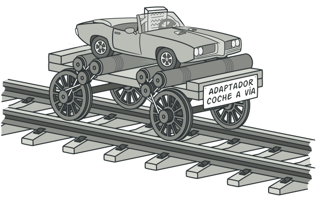

<div style='position: relative; padding-bottom: 56.25%; padding-top: 35px; height: 0; overflow: hidden;'><iframe sandbox='allow-scripts allow-same-origin allow-presentation' allowfullscreen='true' allowtransparency='true' frameborder='0' height='315' src='https://www.mentimeter.com/embed/fdc518b8cfd6221b6e753fccf61f4fed/4f3019ab5592' style='position: absolute; top: 0; left: 0; width: 100%; height: 100%;' width='420'></iframe></div>

<small>☝️ No cierren la página, que hay dos preguntas.</small>

===

## Clase 5

## Interacción con el mundo real


===

 <!-- .element: style="width: 50%" -->

Después del taller, haremos clase de consultas hasta las 21:00. Por supuesto, la participación es **opcional**.

===

## Tareas

En todos los que vi, el patrón **Composite** salió perfecto. 😁

```plantuml
!$BGCOLOR = "transparent"
!theme plain

hide empty members

abstract class Tarea {
  nominaTrabajadores(): Set<Trabajador>
  horasNecesarias(): Int
  costo(): Double
}

class TareaSimple extends Tarea

class TareaIntegracion extends Tarea {
  subtareas: Set<Tarea>
}

TareaIntegracion::subtareas --> Tarea : tiene varias
```

===

## Compartir datos fuera de nuestra aplicación

Al querer "salir" de un programa que hicimos, aparece un problema: cómo hacer para que los datos "vivan" más allá de la ejecución.

--

Las motivaciones para esto pueden ser varias, aunque _grosso modo_ podemos agruparlas en dos:

- **Persistencia:** queremos que los datos _perduren_ en el tiempo.
- **Intercambio:** queremos que estos datos se puedan usar en _otra aplicación_.

Sea cual sera el escenario, vamos a necesitar **serializar** nuestros objetos, convirtiéndolos a bytes o texto.

--

Al respecto, [dice la Wikipedia](https://es.wikipedia.org/wiki/Serializaci%C3%B3n):

> La **serialización** (o marshalling en inglés) consiste en un proceso de codificación de un objeto en un medio de almacenamiento (como puede ser un archivo, o un buffer de memoria) con el fin de transmitirlo a través de una conexión en red como una serie de bytes o en un formato humanamente más legible como XML o JSON, entre otros.

--

Una posible serialización de un proyecto:

```json [1-23|3-4|7,18|8-14,19]
{
  "titulo": "Batanar-Batanero-Incorrectamente",
  "inicio": "2022-08-09T14:19:40.366Z",
  "fin_deseado":"2022-10-02T05:51:08.801Z",
  "tareas": [
    {
      "simple": true,
      "trabajadores": [
        { "nombre": "Gary Centeno", "arancel": 3771 },
        { "nombre": "Madeline Holguín", "arancel": 2899 }
      ],
      "horas": 9,
      "infra": 3485.81,
      "descripcion": "Fideo Gencianáceo General.",
      "responsable": { "nombre": "Leona Gaytán", "arancel": 2054 }
    },
    {
      "simple": false,
      "tareas": [ ... ],
      "responsable": { ... }
    }
  ]
}
```

<!-- .element: class="fullscreen" -->

--

Esto nos lleva al siguiente problema...

===

## [_Impedance mismatch_](https://es.wikipedia.org/wiki/Adaptaci%C3%B3n_de_impedancias_objeto-relacional)

O cómo hacer para que mis objetos encajen con su versión serializada.

--

Cuando surge un requerimiento que implica serializar, tenemos dos opciones:

1. 🤔 **Tirar todo** lo que sabíamos de objetos, y trabajar con el modelo serializado.
1. 😎 Construir "algo" que **transforme** ese modelo serializado en los objetos que tan bien conocemos.

_Imaginen cuál de las dos vamos a recomendar..._

--

### ¿Qué sentido tiene transformar los objetos?

- No atar nuestro diseño al de un sistema externo.
- Poder aplicar todo lo que sabemos de objetos.
- Permitir distintas serializaciones o fuentes de datos.
- Independizar dos aspectos que no tienen por qué estar vinculados.

--

### Dos opciones para resolverlo

| Adapter                                                                                                                                                                       | Transformer                                                                                                                                                              |
| ----------------------------------------------------------------------------------------------------------------------------------------------------------------------------- | ------------------------------------------------------------------------------------------------------------------------------------------------------------------------ |
|  <small style="font-size: 0.5em">Créditos: [Refactoring Gurú](https://refactoring.guru/es/design-patterns/adapter)</small> |  <small style="font-size: 0.5em">Créditos: [Math Insight](https://mathinsight.org/image/function_machine)</small> |

--

En el TP, van a ver que hay un objeto llamado `TareasApi`, que lee el archivo y devuelve un `ProyectoJson`.

De ahí en adelante, tienen que trabajar ustedes.

===

## _Command line interface_ (CLI)

Además de adaptar el JSON, la idea es que puedan construir una pequeña interfaz de línea de comandos que permita interactuar con su programa.

Para este caso, lo que se pide es únicamente poder visualizar los datos de un proyecto que se selecciona al iniciar el programa.

--

```shell
¡Hola! ¿Qué proyecto querés ver?
> p1

El p1 se llama Sarasa. ¿Qué más querés saber?
1 - Lista de tareas
2 - Ver si está atrasado
3 - Otras opciones
> 2

¡Uf! Zafamos, el proyecto no está atrasado. 😀
```

===

## Actividades de la semana

### Completar pendientes de aprobación

Para el **martes 12/10** deberían completar todas las actividades que les marcamos como pendientes. Necesitamos que sea esa fecha porque hay que poner la nota del primer parcial. 😁

### Ejercicio Tareas

Agregarle a lo que ya tenían una interfaz por línea de comandos (CLI).

El objetivo es leer proyectos en formatos JSON y mostrar algunos datos sobre ellos.

===

# ¿Preguntas?


