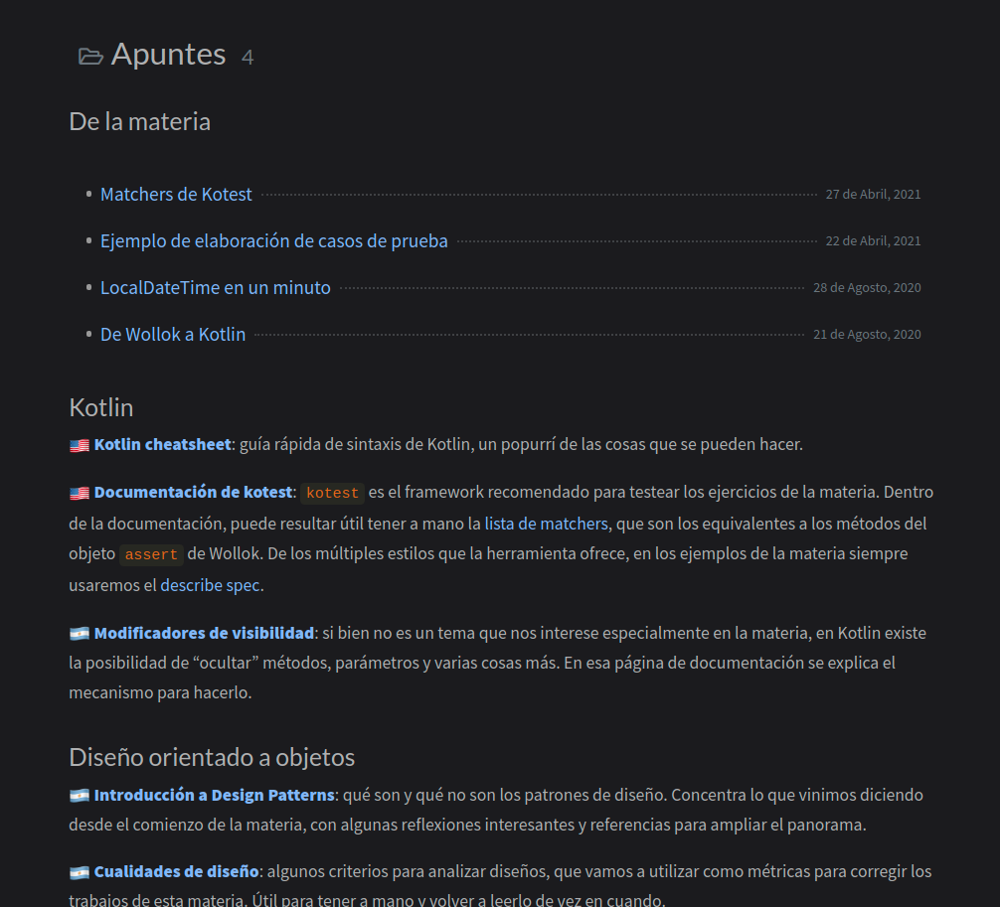
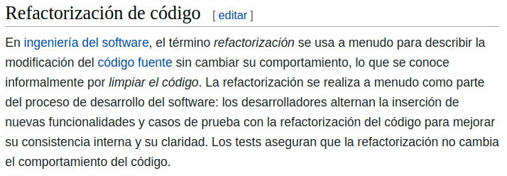

## Clase 5

# Refactorización

===

## Pero antes...

Hablemos del parcial. <!-- .element: class="fragment" -->

===

## Hablemos del parcial

<iframe sandbox='allow-scripts allow-same-origin allow-presentation' allowfullscreen='true' allowtransparency='true' frameborder='0' height='315' src='https://www.mentimeter.com/embed/d8b4fa1a511ce420802c7a8155d4fa1f/80e550401c8c' style='position: absolute; top: 0; left: 0; width: 100%; height: 100%;' width='420'></iframe>

===

## Hablemos del parcial

<iframe sandbox='allow-scripts allow-same-origin allow-presentation' allowfullscreen='true' allowtransparency='true' frameborder='0' height='315' src='https://www.mentimeter.com/embed/e4a2d9f27d0fa1a548a9719f617e075c/d90ae99bc8bb' style='position: absolute; top: 0; left: 0; width: 100%; height: 100%;' width='420'></iframe>

===

## Hablemos del parcial

<iframe sandbox='allow-scripts allow-same-origin allow-presentation' allowfullscreen='true' allowtransparency='true' frameborder='0' height='315' src='https://www.mentimeter.com/embed/6e8515da8a41fd7520a87e1833fa33f9/de12d1729171' style='position: absolute; top: 0; left: 0; width: 100%; height: 100%;' width='420'></iframe>

===

## Comentarios sobre el parcial

Basados pura y exclusivamente en lo que fueron preguntando por Discord.

--

No asuman nada respecto al enunciado, lo que no se entiende, se pregunta.

En esta materia no buscamos que participen del relevamiento ni que inventen requerimientos. Lo que hay que hacer es **diseñar una solución** para el problema que se plantea.

--

Programar es crear un **modelo** de la realidad, que puede o no coincidir con esta. 

En objetos, es perfectamente razonable que:
* un vuelo sepa cómo vender un pasaje,
* un producto sepa cuánto sale,
* una olla sepa cómo limpiarse.

Dónde van los métodos depende de las **decisiones de diseño** que tomen, no de quién tendría esa responsabilidad en la vida real.

--

**Empresa** = entidad que solo conoce sus vuelos y establece la política que determina si se puede vender.

**IATA** = entidad que conoce todos los vuelos y realiza estadísticas.

<small>El enunciado no especificaba si podía haber más de una empresa, así que podrían haberla modelado con objetos o clases. Si usaron clases, las estadísticas sí o sí tienen que ir a la IATA, porque la empresa solo conoce _sus_ vuelos.</small>

--

¡Tener a mano los recursos de la materia! Matchers, colecciones, etc.

===

## Posible solución

Deberían haber aparecido todos los patrones que vimos hasta ahora: **Strategy** (para los criterios), **Singleton** (para la IATA y tal vez la empresa) y **Companion object** (para el Vuelo).

--

Sin saberlo, puede que hayan aplicado el patrón **Template method**. Hay un video sobre esto en la clase.

--

Además, hay otro video que hizo Pablo donde resuelve todo el ejercicio. 

Eso sí, dura 2 horas. ⏲️

===

## Clase 5

# Refactorización

<small>Ahora sí.</small>

===

## Definición

--

### Regla de oro

☝️ Sin tests no se refactoriza.

<small>En ese caso, primero hago los tests, luego refactorizo.</small>

--

## Para tener en cuenta

✅ El código tiene que quedar más _limpio_ que antes.

✅ No se agrega funcionalidad mientras se está refactorizando.

✅ Los tests tienen que seguir pasando.

<small>Tomado de https://refactoring.guru/es/refactoring/how-to</small>

===

## Ejercicios de la clase

Sobre el repo de _Semillas al viento_ que ya tenían, agregar tests y **luego** corregir los defectos de diseño. Hacerlo en, al menos, dos commits.

Hay otro ejercicio corto, llamado _Tareas_, pensado para que apliquen un nuevo patrón llamado **Composite**. También hay un video sobre este patrón.

===

# ¿Preguntas?

