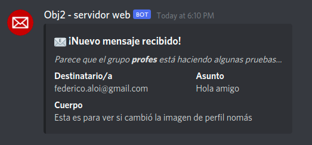

<div style='position: relative; padding-bottom: 56.25%; padding-top: 35px; height: 0; overflow: hidden;'><iframe sandbox='allow-scripts allow-same-origin allow-presentation' allowfullscreen='true' allowtransparency='true' frameborder='0' height='315' src='https://www.mentimeter.com/embed/9cf05e9ab992089b1ce6dd46df446933/62a98266d88a' style='position: absolute; top: 0; left: 0; width: 100%; height: 100%;' width='420'></iframe></div>

<small>☝️ No cierren la página, que hay dos preguntas.</small>

===

## Clase 6

## Comunicación entre componentes


===

## Avisos parroquiales 🔔

Ya pusimos la nota correspondiente al primer parcial, se las avisamos por los canales privados.

Cualquier duda, sugerencia o reclamo lo hacen por esa vía.

--

 <!-- .element: style="width: 50%" -->

Después del taller, haremos clase de consultas hasta las 21:00. Por supuesto, la participación es **opcional**.

--

 <!-- .element: style="width: 40%" -->

La participación es **obligatoria**, pueden aprovechar y hacer todo el mismo día. 😉

- 25 hasta el 29 de Octubre de 11 a 19hs.
- 30 de Octubre de 10 a 13hs.

<small>Más info en http://www.unahur.edu.ar/es/elecciones-2021.</small>

===

## Tareas

--

### Pocas entregas 😢

¿Pasó algo? ¿Se les juntó con otras materias? ¿No se entendió nada?

--

### Fechas

No dijimos cómo hacerlo, pero varios grupos le encontraron la vuelta. Agregué al apunte **Manejo de fechas** dos secciones que muestran cómo manipular strings.

--

En particular, la fecha estaba en formato ISO con zona horaria, la forma más fácil de _parsearla_ era esta:

```kotlin
// Devuelve un objeto que representa a esa fecha y hora
LocalDateTime.parse(
  "2021-10-19T12:30:15.223Z",
  DateTimeFormatter.ISO_OFFSET_DATE_TIME
)
```

===

## Cómo probar dependencias externas



¿Cómo pruebo que el envío de mails funciona **sin** tener que mandar un mail de verdad?

--

Partamos de este ejemplo...

```kotlin
interface ClienteMail {
  fun enviar(asunto: String, destinatario: String, cuerpo: String)
}

class EnvioDomicilio(
  val comprador: Usuario,
  val clienteMail: ClienteMail,
  val producto: Producto
) {
  fun notificarDespacho() {
    clienteMail.enviar(
      "¡Tu producto está en camino!",
      comprador.correoElectronico,
      armarCuerpo(),
    )
  }
}
```

<!-- .element: class="fullscreen" -->

--

Puedo hacer una clase _impostora_ que registra los mails (pero no los manda):

```kotlin
data class Mail(
  val asunto: String, val destinatario: String, val cuerpo: String
)

object ClienteMailTrucho: ClienteMail {
  val enviados = mutableListOf<Mail>()

  override fun enviar(
    asunto: String, destinatario: String, cuerpo: String
  ) {
    enviados.add(Mail(asunto, destinatario, cuerpo))
  }
}
```

--

Y en el test, compruebo que lo que yo quería mandar está en esa lista:

```kotlin
it("envía mail al comprador") {
  // Configuro al producto para que use el cliente impostor
  envioSierraCircularBosch.clienteMail = ClienteMailTrucho

  // Realizo la acción que provoca el envío de mail
  envioSierraCircularBosch.notificarDespacho()

  // Verifico que el envio "ocurrió"
  ClienteMailTrucho.enviados.shouldContain(
    Mail(
    "¡Tu producto está en camino!",
    "faloi@pm.me",
    "No te cuelgues, en 10 minutos te llega tu Sierra Circular Bosch."
    )
  )
}
```

<!-- .element: class="fullscreen" -->

--

Como esto es una tarea común (y bastante embolante), en general los frameworks ofrecen una solución.

En esta materia vamos a usar [MockK](https://mockk.io/), una biblioteca para Kotlin que tiene una interfaz bastante amigable.

--

Lo que se suele hacer es crear un objeto _impostor_ y luego verificar **que se haya llamado a cierto método** con los parámetros correspondientes:

```kotlin
it("envía mail al comprador") {
  // Configuro al producto para que use el mock
  envioSierraCircularBosch.clienteMail = clienteMailMock

  // Realizo la acción que provoca el envío de mail
  envioSierraCircularBosch.notificarDespacho()

  // Verifico que el envio "ocurrió"
  verify {
    clienteMailMock.enviar(
      "¡Tu producto está en camino!",
      "faloi@pm.me",
      "No te cuelgues, en 10 minutos te llega tu Sierra Circular Bosch."
    )
  }
}
```

--

Y la creación y configuración del mock sería así:

```kotlin
describe("Al notificar despacho") {
  // Creamos un objeto impostor (mock),
  // que implementa la interfaz ClienteMail
  val clienteMailMock = mockk<ClienteMail>()

  // Lo configuramos para que el método `enviar` no haga nada.
  every {
    clienteMailMock.enviar(any(), any(), any())
  } just Runs

  it("envía mail al comprador") {
    // Acá vendría el test que ya mostramos...
  }
}
```

--

¿Qué ganamos al incorporar una biblioteca de impostores?

- No tenemos que implementar las clases "truchas" a mano.
- Toda la configuración del impostor queda en el test, que es en el único lugar donde tiene sentido.
- Nos da facilidades para escribir aserciones sobre los impostores.

===

## Comunicación entre componentes

Hasta ahora veníamos modelando mecanismos de comunicación **sincrónica**: A interactúa con B enviándole un mensaje, que B responde.

```plantuml
!$BGCOLOR = "transparent"
!theme plain
Vuelo -> Avion: capacidadMaxima()
Avion --> Vuelo: 180
```

--

En algunos casos, es necesario que esa comunicación sea **asincrónica**. Motivos usuales:

- El procesamiento tarda.
- No importa la respuesta.
- Depende de un evento que no se sabe cuándo va a ocurrir.

--

Un mecanismo posible, conocido como **poll**:

```plantuml
!$BGCOLOR = "transparent"
!theme plain
Analizador -> Servidor: queHayDeNuevo()
Servidor --> Analizador: ❌ nada
Analizador -> Servidor: queHayDeNuevo()
Servidor --> Analizador: ✅ procesé 3 pedidos: ...
Analizador -> Servidor: queHayDeNuevo()
Servidor --> Analizador: ❌ nada
Analizador -> Servidor: queHayDeNuevo()
Servidor --> Analizador: ❌ nada
```

<small>Las desventajas son evidentes...</small>

--

En cambio, si le pedimos que "avise" cuando un evento ocurre:

```plantuml
!$BGCOLOR = "transparent"
!theme plain
Servidor -> Analizador: meLlegoUnPedido(pedido)
Analizador --> Servidor: 😃 ¡Gracias!
```

En objetos, a esto se lo conoce como patrón **Observer**. También puede que lo escuchen como _hook_, _webhook_ o similar.

<!-- .element: class="fragment" -->

--

La idea es siempre la misma:

1. Un componente o sistema **produce** eventos.
1. Otros componentes o sistemas están interesados en **consumir** esos eventos.
1. Los consumidores se registran en el productor.
1. El productor le avisa a todos los consumidores cuando algo pasa.

--

Otro mecanismo posible es comunicarse mediante **memoria compartida** (o _shared memory_): los componentes no se comunican entre sí directamente, lo hacen a través de algún intermediario.

--

```plantuml
!$BGCOLOR = "transparent"
!theme plain
Analizador -> ColaMensajes: queHayDeNuevo()
ColaMensajes --> Analizador: ❌ nada
Servidor -> ColaMensajes: meLlegoUnPedido(pedido)
ColaMensajes --> Servidor: 😃 ¡Gracias!
Analizador -> ColaMensajes: queHayDeNuevo()
ColaMensajes --> Analizador: ✅ Llegó 1 pedido
```

Y esto se puede seguir complejizando hasta el infinito. 😅

===

## Actividades de la semana

### Decidir si quieren cambiar de grupo

Voy a inaugurar un canal para quienes quieran hacerlo. Puede estar buena la experiencia de probar otra dinámica o puede ser un garronazo... queda a elección de ustedes.

### Ejercicio Servidor web

Van a simular el comportamiento de un servidor que atiende pedidos HTTP, y que tiene analizadores configurables.

===

# ¿Preguntas?


